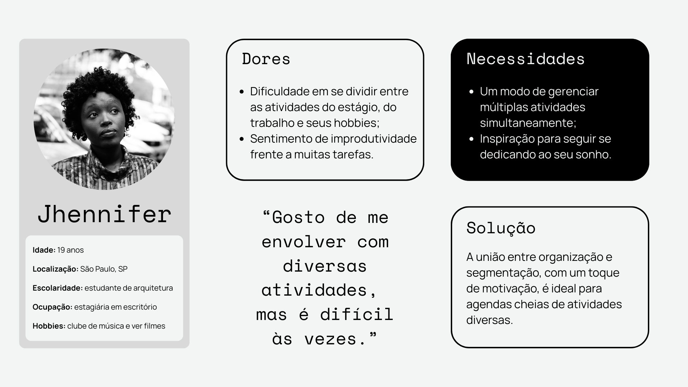
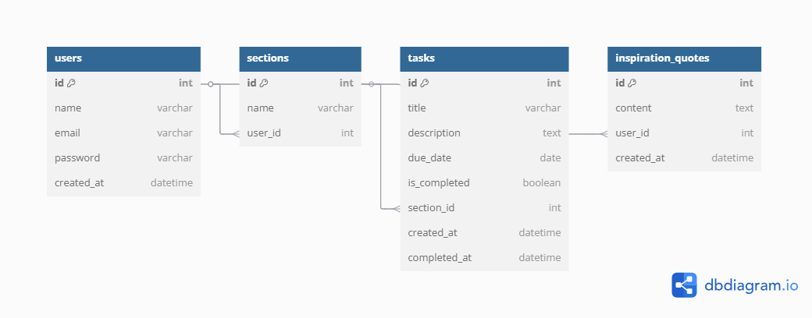
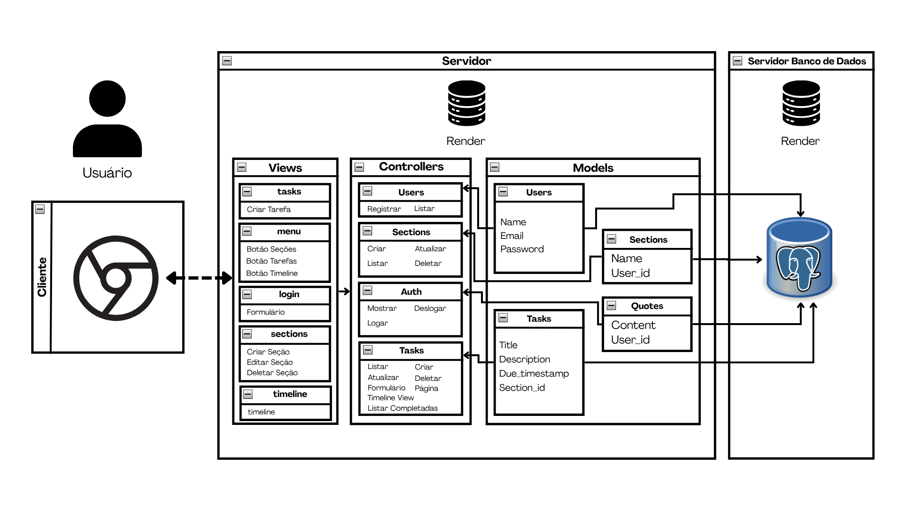

# Web Application Document - Projeto Individual - Módulo 2 - Inteli

## Taskline

#### Paulo Vitor Barros de Almeida

## Sumário

1. [Introdução](#c1)  
2. [Visão Geral da Aplicação Web](#c2)  
3. [Projeto Técnico da Aplicação Web](#c3)  
4. [Desenvolvimento da Aplicação Web](#c4)  
5. [Referências](#c5)  

<br>

## <a name="c1"></a>1. Introdução (Semana 01)

O sistema a ser desenvolvido é uma plataforma de gestão de atividades para pessoas com múltiplas tarefas, focada em organizar, monitorar e motivar os usuários a gerenciar suas tarefas acadêmicas e profissionais. A aplicação permitirá que os usuários criem diferentes seções para suas atividades, segmentando-as de acordo com suas origens e prioridades. Além disso, contará com uma linha do tempo para visualizar as tarefas entregues e acompanhar a produtividade ao longo do tempo.

A plataforma também incluirá uma funcionalidade para mostrar frases inspiradoras, proporcionando uma fonte de motivação para os usuários, ajudando-os a se manterem focados e engajados na conclusão de suas pendências.

A estrutura do sistema seguirá o padrão MVC (Model-View-Controller), organizando de forma clara a lógica de negócios, a interface com o usuário e o gerenciamento dos dados. O sistema terá uma interface simples e intuitiva, permitindo que os usuários naveguem facilmente entre as seções de atividades, visualizem o progresso de suas tarefas e recebam inspiração de maneira rápida e eficiente.

---

## <a name="c2"></a>2. Visão Geral da Aplicação Web

### 2.1. Personas (Semana 01 - opcional)

A criação de uma persona é um recurso que consiste em modelar o público típico de determinada solução, de modo a facilitar o entendimento do público-alvo de um produto ou serviço. Dessa maneira, para a aplicação WEB Taskline, modelou-se uma persona que tipicamente se envolve com inúmeras atividades, sejam elas acadêmicas, estracurriculares, profissionais ou de lazer e, por esse motivo, não consegue controlar adequadamente as suas tarefas. Além disso, delineou-se uma persona que desejasse meios de se motivar constantemente e de acompanhar sua produtividade. Sendo assim, a figura abaixo representa a persona pensada para o projeto.

<div align="center">
<sub>Figura - Persona</sub>

<sup>Fonte: Material produzido pelo autor (2025)</sup>
</div>

### 3.1. Modelagem do banco de dados  (Semana 3)

#### 3.1.1. Modelagem Relacional

<div align="center">
<sub>Figura - Modelo Relacional</sub>

<sup>Fonte: Material produzido pelo autor (2025)</sup>
</div>

#### 3.1.2. Modelo Físico

```sql
CREATE TABLE users (
  id SERIAL PRIMARY KEY,
  name VARCHAR,
  email VARCHAR,
  password varchar,
  created_at DATE
);

CREATE TABLE sections (
  id SERIAL PRIMARY KEY,
  name VARCHAR,
  user_id int,
  FOREIGN KEY (user_id) REFERENCES users(id)
);

CREATE TABLE tasks (
  id SERIAL PRIMARY KEY,
  title VARCHAR,
  description VARCHAR,
  due_date DATE,
  due_time TIME,
  is_completed BOOLEAN,
  section_id INT,
  created_at DATE,
  completed_at DATE,
  FOREIGN KEY (section_id) REFERENCES sections(id)
);

CREATE TABLE inspiration_quotes (
  id SERIAL PRIMARY KEY,
  content TEXT,
  user_id INT,
  created_at DATE
);

ALTER TABLE inspiration_quotes
ADD FOREIGN KEY (user_id) REFERENCES users(id)
```

### 3.1.1 BD e Models (Semana 5)
*Descreva aqui os Models implementados no sistema web*

### 3.2. Arquitetura (Semana 5)

<div align="center">
<sub>Figura - Persona</sub>

<sup>Fonte: Material produzido pelo autor (2025)</sup>
</div>

O projeto utiliza a arquitetura MVC:

- **Model**: arquivos em `models/`, responsáveis pelo acesso ao banco de dados.
- **Controller**: arquivos em `controllers/`, recebem as requisições e chamam os models.
- **Routes**: arquivo `routes/index.js`, define os endpoints e redireciona para os controllers.
- **View**: arquivos em `views/`, montam a visualização da plataforma com HTMLK e CSS.

### 3.3. WebAPI e endpoints (Semana 05)

#### **/tasks**
- `POST /tasks`: cria uma nova tarefa.
- `GET /tasks`: retorna todas as tarefas.

#### **/users**
- `POST /users`: cria um novo usuário.
- `GET /users`: retorna todos os usuários.

#### **/quotes**
- `POST /quotes`: cria uma nova frase inspiradora.
- `GET /quotes`: retorna todas as frases.

#### **/sections**
- `POST /sections`: cria uma nova seção.
- `GET /sections`: retorna todas as seções.

> Endpoints `PUT` e `DELETE` ainda não foram implementados.

### 3.7 Interface e Navegação (Semana 07)

Referente ao frontend da aplicação WEB, ao longo da Semana 7, foi desenvolvido uma página de login estático, um menu que centraliza os redirecionamentos para as demais funçoes, telas para criar tarefas e seções, e um visualização em formato de linha do tempo para as tarefas.

#### Login
A tela de login pede email e senha. Contudo, no período da sétima semana de desenvolvimento, apenas é possível acessar o site com o seguinte login estático: email = admin@email.com e senha = 1234. Futuramente, pretende-se desenvolver a funcionalidade da cadastro e login completa e funcional.

<p align = "center">Figura: Tela de Login </p>

<p align="center">  </p>

<p align = "center">Fonte: Material produzido pelo autor (2025).</p> <br>


#### Menu
Na página de menu você encontra botões para as demais telas, bem como uma frase inspiradora no rodapé que está também nas outras telas.

<p align = "center">Figura: Tela de Menu </p>

<p align="center">  </p>


<p align = "center">Fonte: Material produzido pelo autor (2025).</p> <br>

#### Seções
Na tela de seções você consegue criar e editar seções.

<p align = "center">Figura: Tela de Seções</p>

<p align="center">  </p>

<p align = "center">Fonte: Material produzido pelo autor (2025).</p> <br>

#### Tarefas
Na tela de tarefas você consegue ver suas tarefas e criar novas.

<p align = "center">Figura: Tela de Tarefas </p>

<p align="center">  </p>

<p align = "center">Fonte: Material produzido pelo autor (2025).</p> <br>

#### Timeline
Na tela de timeline você consegue visualizar suas tarefas em ordem cronológica.

<p align = "center">Figura: Tela de Timeline </p>

<p align="center">  </p>

<p align = "center">Fonte: Material produzido pelo autor (2025).</p> <br>

---

## <a name="c4"></a>4. Desenvolvimento da Aplicação Web (Semana 8)

### 4.1 Demonstração do Sistema Web (Semana 8)

*VIDEO: Insira o link do vídeo demonstrativo nesta seção*
*Descreva e ilustre aqui o desenvolvimento do sistema web completo, explicando brevemente o que foi entregue em termos de código e sistema. Utilize prints de tela para ilustrar.*

### 4.2 Conclusões e Trabalhos Futuros (Semana 8)

A plataforma Taskline se destaca por sua interface simples e intuitiva, que torna prático o gerenciamento e visualização das tarefas do dia a dia. Por outro lado, a plataforma poderia ofercer opções simples de personalização e uma estética mais condizente com a proposta apresentada. Sendo assim, possíveis melhorias para o futuro seriam definir uma identidade visual coesa, como formatar a visualização da tela de Timeline para uma linha do tempo de verdade, assim como permitir que o usuário personalizasse as frases motivacionais que aparecem no footer. Além disso, o site ainda não conta com um sistema de registro, que deve ser criado no futuro.

## <a name="c5"></a>5. Referências

_Incluir as principais referências de seu projeto, para que o leitor possa consultar caso ele se interessar em aprofundar._<br>

---
---
